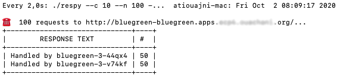

# Introduction
Bluegreeen is a simple application based on multiple languages (only php for now) to demonstrate how it's easy to deploy an application in OpenShift Container Platform (OCP).

After completing this tutorial you will be able to accomplish the following tasks:

- Building reproducible container images from source code
- Deploy an application to an OpenShift cluster
- Demonstrate service load balancing - VIP load balancing like
- Lots of Kube features :-)
 
| blue | green |
|--|--|
|||

# Architecture

| Service name | Language | Description |
|:--:|:--:|:--|
| bluegreen | php | Provide a colorful image through HTTP depending on environment variable|

# Requirements

- Openshift 4.5+ (Installed and configured)
- oc cli

# Setup

No setup is needed to run bluegreen application alone. Il you want to add other features, please check bluegreen-* repositories.

# Installation
In this section, if a new feature requires an installation procedure, it will be included in a different paragraph.
## I - Installing bluegreen application
**1 - Clone the project**

```shell
git clone https://github.com/atiouajni/bluegreen
cd bluegreen
 ```


**2 - Create a new Openshift project**

```shell
oc new-project bluegreen
```

**3 - Create bluegreen resources**

```shell
oc apply -f openshift-manifests/bluegreen-php/
```

**4 - Check building and deploying stages**

```shell
oc get pods -w
```

**5 - Access the bluegreen app**    

```shell
export BLUEGREEN_URL=$(oc get route bluegreen -o jsonpath='{.spec.host}')
echo $BLUEGREEN_URL

#Check the HTTP status, you should receive 200. If not, please check your ServiceMeshMemberRoll if Istio is already used
curl -o /dev/null -s -w "%{http_code}\n" http://$BLUEGREEN_URL/image.php
```

>Well done ! At this stage, you are able to demonstrate many OpenShift features. Please check the [#Usage](#Usage) section before going ahead. 

# Usage
## Once the application is deployed
**You can change the default color (blue) to green**

```shell
oc set env dc/bluegreen COLOR=green
```
Open a web browser and verify that the color is green now. 

**You can demonstrate the rolling deployment strategy**

First, We will increase the number of replicas of our bluegreen application. Then, we will build and deploy a new version of our app.

```shell
#Scale the number of Pods
oc scale --replicas=4 dc/bluegreen

#Build a new image
oc patch bc bluegreen --type='json' -p='[{"op": "replace", "path": "/spec/output/to/name", "value":"bluegreen:v2"}]'
oc start-build bluegreen --follow

#Set a new image. This will automatically trigger a new deployment
oc set image dc/bluegreen bluegreen=bluegreen/bluegreen:v2

#Watch how the rolling deployment will slowly replaces instances of the previous version 
oc rollout status dc/bluegreen
```


>A rolling deployment waits for new pods to become ready via a [readiness check](https://docs.openshift.com/container-platform/4.5/applications/application-health.html) before scaling down the old components. 

**You can demonstrate the default load balancing strategy**

```shell
#Scale the number of Pods
oc scale --replicas=2 dc/bluegreen

#Check the percentage distribution
#Respy is a tool which provides an aggregation of a number of simultaneous calls
watch -p ./respy --c 10 --n 100 --u http://$BLUEGREEN_URL/
```


**You can enable Horizontal Pod Autoscaling (HPA)**
```shell
#To enable autoscaling, we need to define a cpu range before
oc set resources dc bluegreen --requests=cpu=60m --limits=cpu=100m

#Enable autoscaling
oc autoscale dc/bluegreen --min 1 --max 10 --cpu-percent=30

#Watch how the Deployment will scale automatically (more Pods should appear)
watch -p ./respy --c 10 --n 100 --u http://$BLUEGREEN_URL/
```
# Cleanup

```shell
oc delete project bluegreen
```

  

# Documentation

More details will be found in ./docs folder.

# Released versions

In progress...